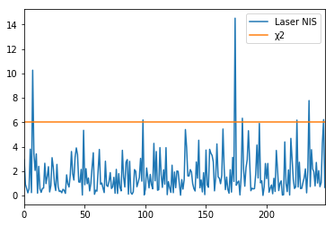

# Unscented Kalman Filter Project
Udacity Self-Driving Car Engineer Nanodegree Program

This project uses an [unscented Kalman filter](https://www.seas.harvard.edu/courses/cs281/papers/unscented.pdf) to combine radar and lidar measurements to track a bicycle circling a car in a simulator.

The simulator can be downloaded from the [github repository](https://github.com/udacity/self-driving-car-sim/releases).

The supporting websockets code (using the [uWebSockets library](https://github.com/uNetworking/uWebSockets)) and basic project structure come from the [Udacity repository](https://github.com/udacity/CarND-Unscented-Kalman-Filter-Project).
The README at that repository has extensive details for build and setup.

## Basic Build Instructions

1. Clone this repo.
2. Make a build directory: `mkdir build && cd build`
3. Compile: `cmake .. && make` 
   * On windows, you may need to run: `cmake .. -G "Unix Makefiles" && make`
4. Run it: `./ExtendedKF`

## Files
[ukf.cpp](https://github.com/gardenermike/unscented-kalman-filter/blob/master/src/ukf.cpp) implements the unscented Kalman filter code.

[tools.cpp](https://github.com/gardenermike/unscented-kalman-filter/blob/master/src/tools.cpp) implements a straightforward RMSE calculator.

## Discussion
The basic idea of the Kalman filter is to model the position of a moving object with an assumption of linear motion, using a Gaussian distribution to model uncertainty. As time passes, the variance of the distribution is expected to increase, as uncertainty increases. Measurement increases certainty, shifting the mean of the distribution and reducing the variance.

The Kalman filter is just a loop between measurement and prediction called when each measurement arrives. Prediction will calculate the expected position and velocity of an object based on the elapsed time interval, and measurement refines that expectation based on new data.

The _unscented_ part of the extended Kalman filter handles non-linear data. The "unscented" Kalman filter is an alternative to the extended Kalman filter, with better handling of nonlinearities. Instead of using a linear approximation of non-linear processes, the unscented Kalman filter uses a sample set of "sigma points" to predict motion of the tracked object, allowing an effectively Gaussian estimate of position. By using a set of representative points instead of direct calculation of derivatives of a nonlinear model, computation complexity is kept reasonable.

### Results
The results are best compared with my [extended Kalman filter](https://github.com/gardenermike/extended-kalman-filter) results.
Using the same dataset, the root mean squared errors for the x and y positions and velocities in x and y are:

| Field | Unscented Kalman Filter | Extended Kalman Filter |
| ----- | ---------------------- | ----------------------- |
| *X* | 0.0718 | 0.0974 |
| *Y* | 0.0839 | 0.0855 |
| *X Velocity* | 0.1918 | 0.4517 |
| *Y Velocity* | 0.2754 | 0.4404 |

Note that the estimates of X and Y are clearly better, but the velocity predictions vs ground truth are much better, with the RMSE approximately halved.

Unlike the extended Kalman filter, the unscented Kalman filter came with more parameters to tune. Specifically, the initial values of the covariance matrix P and estimates of the process noise had a significant effect on the filter results.
I began with the identity matrix for P, but reduced the X and Y values each to 0.02 from their initial values of 1. Assuming a greater certainty of initial position led to faster convergence.
I am using an estimate of 2 meters/second squared for my longitudinal acceleration noise and 1 radian per second in yaw acceleration noise. These came from real-world estimates thinking of my own time on a bicycle. I could probably lose speed by braking at 2 meters/second in negative acceleration, and a bicycle can turn fairly quickly in a second; potentially a third of the way around (~1 radian). To validate the noise, I used the Normalized Innovation Squared (NIS) metric.

Graphs for radar and laser predictions for NIS, with the 95% chi-squared threshold marked, are below. For both radar and laser, the 95% threshold seems approximately correct.

The merits of laser/lidar and radar measurements are discussed somewhat in my [extended Kalman filter](https://github.com/gardenermike/extended-kalman-filter) project.

A video of a full run in the simulator is on [YouTube](https://youtu.be/e-56YKtx5hE).
